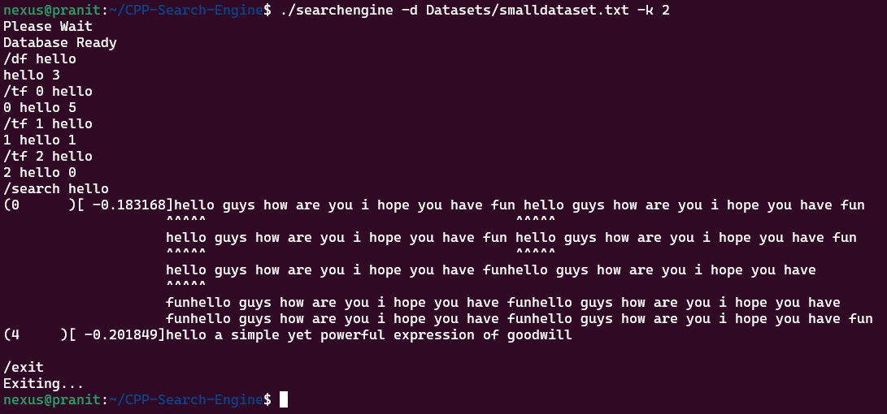

# CPP-Search-Engine
A Trie structure based local search engine coded in C++

To compile it
```
make
```
to run it pass to the same folder a txt file with the correct format such as(smalldataset and bigdataset) or give relative path or full path
```bash
./searchengine -d Dataset/smalldataset.txt -k 3
```
Here document_name follows `-d` and the number of best results to be shown is passed after `-k`

Once the Database is Ready to process, we can have 3 seach queries :
* `/search <word>` - This gives us the scorewise ordered, list of sentences along with the word searched for highlighted. Can input sentence instead of word as well.
  - `/df [word]` - gives how many lines contains that particular word
  - `/df` - lists all words and their no. of occurences.

* `/tf [file_no] [word]` - gives us if the particular line has that word (and ot's frequncy)

